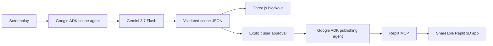

# ScriptStage — AI screenplay-to-3D previsualization

## Partner track

Replit

## Challenge requirement

> Build a functional agent—powered by Gemini and Google Cloud Agent Builder—that integrates a Partner Entity's product or MCP to power a real media & entertainment workflow.

This project covers each part of that requirement:

| Requirement | Implementation |
| --- | --- |
| Functional agent | `rootAgent` in `app/scene/gemini.ts` runs behind `POST /api/generate-scene`. |
| Powered by Gemini | The agent uses `gemini-3.7-flash` with structured scene-plan output. |
| Google Cloud Agent Builder | The agent is built with Google's open-source Agent Development Kit (`@google/adk`), the agent-building framework in Google Cloud's Agent Builder suite. It runs locally to preserve the $0 configuration. |
| Partner integration | A second ADK agent connects to the official Replit MCP endpoint and exposes `create_app_from_prompt`, `update_app_using_prompt`, and `ask_question`. |
| Real media workflow | A filmmaker pastes a screenplay, reviews an interactive Three.js blockout, tests camera angles, and can explicitly hand the approved plan to Replit Agent as a shareable 3D app. |

Google references: [Vertex AI Agent Builder](https://docs.cloud.google.com/agent-builder), [Agent Development Kit](https://docs.cloud.google.com/gemini-enterprise-agent-platform/build/adk), and [ADK documentation](https://adk.dev/). Partner reference: [Replit MCP server](https://docs.replit.com/platforms/mcp-server).

## Architecture



The scene agent extracts the first scene's environment, time of day, visible characters, props, dimensions, colors, and spatial staging. The app clamps and validates all model output before Three.js renders it; generated code is never executed in the local preview.

The Replit publishing agent is isolated from ordinary generation. It receives MCP tools only after the user selects **Create app on Replit** and confirms that individual operation. It requests Replit's `3d_game` stack and prohibits paid APIs in the generated-app prompt.

## Run locally for $0

Requires Node.js 22.13 or newer.

```bash
npm install
cp .env.example .env.local
npm run dev
```

Open `http://localhost:3000/create`.

Create `GEMINI_API_KEY` in [Google AI Studio](https://aistudio.google.com/api-keys) from a project whose billing tier says **Free**. Do not link a billing account or upgrade the project if the goal is to make charges impossible. The key stays in the server environment and is never sent to browser JavaScript.

Google ADK and the Next.js API run on the local computer. The app is not deployed to Vertex AI Agent Engine, Cloud Run, or another Google Cloud runtime. This still uses the Agent Builder development framework while avoiding managed-runtime charges. Gemini's free tier has usage limits and can temporarily reject requests when its quota is exhausted; the local rule-based generator remains available.

## Connect the Replit partner integration

Replit's official MCP server uses OAuth 2.1 with PKCE. Complete authorization through an OAuth-capable Replit MCP client, then place the resulting access token in `.env.local`:

```bash
REPLIT_MCP_ACCESS_TOKEN=your_replit_oauth_access_token
```

Restart the app after changing environment variables. Tokens stay server-side. The integration connects to `https://replit-mcp.com/server/mcp` with Streamable HTTP through ADK's `MCPToolset`.

Replit documents support for free accounts. Stay on Replit's free plan and do not add payment information or upgrade; if the included Agent allowance is unavailable, stop and wait for the allowance to reset. The local preview does not require Replit.

## Current capabilities and limits

- Gemini understands screenplay structure and returns a bounded, serializable scene plan.
- Three.js renders a procedural, explorable blockout with wide, close, and overhead shots.
- The app supports people, cars, furniture, trees, architectural pieces, rocks, and generic primitive props.
- Scripts are limited to 12,000 characters, scenes to 30 objects, and only the first screenplay scene is staged.
- Replit MCP can create a separate shareable 3D app after explicit confirmation.
- The current output is previsualization geometry. It does not create production-quality sculpted meshes, rigging, or animation.

## Verification

```bash
npm run test:scene
npm run lint
npm run build -- --webpack
node --test tests/rendered-html.test.mjs
```

Key files:

- `app/scene/gemini.ts` — Gemini scene agent built with Google ADK.
- `app/agent/replit.ts` — Replit MCP toolset and publishing agent.
- `app/api/generate-scene/route.ts` — server-only scene-agent endpoint.
- `app/api/replit/route.ts` — confirmed Replit MCP publishing endpoint.
- `app/scene/screenplay.ts` — validated scene format and local fallback.
- `app/scene/desert-scene.ts` — data-driven procedural Three.js renderer.
- `app/SceneDemo.tsx` — screenplay editor, preview, and partner handoff.
